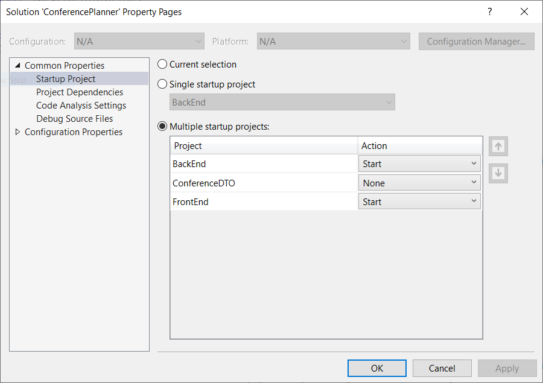

# Workshop2019

## What you'll be building

In this workshop, we'll start with sample ASP.NET Core application. This application comprises of an API-backend, a web front-end application, and a common library for shared data transfer objects.

However, this application is riddled with anti-patterns that prevent this application from scaling well. Due course of this workshop, we'll attempt to fix some of the issues with the application.

## Getting started

To begin with let's start by cloing and building the starting point of the project.
Start by navigating to the `./lab` directory and building the solution

```powershell
git clone https://github.com/shirhatti/ReadyWorkshop2019.git
cd .\ReadyWorkshop2019\lab\
dotnet build
```

At this point you should able to successfully launch Visual Studio

```powershell
.\ConferencePlanner.sln
```

If everything is looking good so far, navigate to the Backend project and run the following commands in the command prompt to setup your database correctly

```powershell
cd .\ReadyWorkshop2019\lab\BackEnd
dotnet ef migrations add Initial
dotnet ef database update
```

## Upload the initial data

Instead of using Entity Framework to seed the data, let's use an existing API endpoint that we have that allows us to upload a conference file format.

We will be using the existing `/api/Conferences/upload` endpoint to `POST` a file containing the conference schedule.

Let's a closer look at this method

```csharp
[HttpPost("upload")]
[Consumes("multipart/form-data")]
public async Task<IActionResult> UploadConference([Required, FromForm]string conferenceName, IFormFile file, CancellationToken cancellationToken)
{
    var loader = new SessionizeLoader();

    using (var ms = new MemoryStream())
    {
        file.CopyTo(ms);
        ms.Position = 0;
        await loader.LoadDataAsync(conferenceName, ms, _db);
    }

    await _db.SaveChangesAsync();

    return Ok();
}
```

While on first glance there isn't anything wrong this method, on closer inspection we notice that we can directly access the underlying stream via `file.OpenReadStream()`. While in our case, there isn't of much impact, it could be problematic when dealing with larger files. By default when reading any single file larger than 64KB, it will be moved from RAM to a temp file by MVC. By copying it into a MemoryStream, we just undid all hard work done by the framework for us.

How would you fix this code?

===

```csharp
[HttpPost("upload")]
[Consumes("multipart/form-data")]
public async Task<IActionResult> UploadConference([Required, FromForm]string conferenceName, IFormFile file, CancellationToken cancellationToken)
{
    var loader = new SessionizeLoader();

    using (var stream = file.OpenReadStream())
    {
       loader.LoadData(conferenceName, stream, _db);
       await loader.LoadDataAsync(conferenceName, stream, _db, cancellationToken);
    }

    await _db.SaveChangesAsync();

    return Ok();
}
```

At this point we're ready to import data.

Run the application and use the Swagger UI to upload the `.\lab\BackEnd\Data\Import\NDC_London_2019.json` file to the `/api/Conferences/upload` API. Let's give the conference the name `NDCLondon`.

You can use the Swagger UI and verify that your upload was successful by trying a `GET` request on `/api/Conferences`. We should see the conference with the name `NDCLondon` that we just created.

## Format log messages

Let's continue taking a look at the Backend application. Head over to `Startup.cs` file. You'll notice a call to `app.UseMiddleware<RequestHeaderLoggingMiddleware>()` as part of the Configure Method.

This is a middleware that we've introduced for diagnostic purposes. It logs the value of all incoming request header and can be extremely useful during debugging.

```csharp
public Task Invoke(HttpContext context)
{
    var builder = new StringBuilder(Environment.NewLine);
    foreach (var header in context.Request.Headers)
    {
        builder.AppendLine($"{header.Key}:{header.Value}");
    }
    _logger.LogTrace(builder.ToString());

    return _next(context);
}
```

However, you'll notice that we're serializing the header collection on every request, even if it ends up not getting logged due to the chosen filtering level.

You can try this by changing the log level for the `BackEnd.RequestHeaderLoggingMiddleware` in `appSettings.json`. As an exercise, how would you avoid this expensive serialization in the event that we end up not writing the log message?

===

```csharp
public Task Invoke(HttpContext context)
{
    if (_logger.IsEnabled(LogLevel.Trace))
    {
        var builder = new StringBuilder(Environment.NewLine);
        foreach (var header in context.Request.Headers)
        {
            builder.AppendLine($"{header.Key}:{header.Value}");
        }
        _logger.LogTrace(builder.ToString());
    }

    return _next(context);
}
```

The answer is indeed an elegant solution where all we're doing is wrapping our entire serialization in an if block if the logger is not enabled.

## Explore

Now that we have some initial data and our database is seeded, trying playing around with app and get a feel for what is happening. I recommend changing your startup project in Visual Studio to launch both the FrontEnd and the Backend.

### Change startup project

Change the startup project to launch both the FrontEnd and the BackEnd




## Cancelling Tasks

Let's us turn our attention over to the `SearchController` in the backend. Search operations can be expensive and we want limit the thrashing of our database. Therefore in the `SearchController` we have implemented Timeouts on expensive database queries. The `TimeoutAfter` method has been implemented as an extension method that hangs off of `Task`. Let look at how's it's being used in the Controller.

```csharp
...
var sessionResults = await sessionResultsTask.TimeoutAfter(TimeSpan.FromSeconds(1));
var speakerResults = await speakerResultsTask.TimeoutAfter(TimeSpan.FromSeconds(1));
...
```

As evident from the usage, we want our expensive database queries to timout after 1 seconds. Let's look at the actual implementation of how we've achieved this.

```csharp
public static async Task<T> TimeoutAfter<T>(this Task<T> task, TimeSpan timeout)
{
    var delayTask = Task.Delay(timeout);

    var resultTask = await Task.WhenAny(task, delayTask);
    if (resultTask == delayTask)
    {
        // Operation cancelled
        throw new OperationCanceledException();
    }

    return await task;
}
```

While naively this might look like it works, we're not cancelling the delayTask we're creating even when our operation successfully completes. With this we could easily end up with timer queue flooding especially if this occurs on the hot path. The right approach here is to ensure the timer is being disposed of.

How would you ensure that the timer is being disposed correctly?

===

```csharp
public static async Task<T> TimeoutAfter<T>(this Task<T> task, TimeSpan timeout)
{
    using (var cts = new CancellationTokenSource())
    {
        var delayTask = Task.Delay(timeout, cts.Token);

        var resultTask = await Task.WhenAny(task, delayTask);
        if (resultTask == delayTask)
        {
            // Operation cancelled
            throw new OperationCanceledException();
        }
        else
        {
            // Cancel the timer task so that it does not fire
            cts.Cancel();
        }

        return await task;
    }
}
```

## Prevent port exhaustion

Let's jump over to our FrontEnd to look at this problem. We've registered a scoped service `ApiClient` to make it easier to make API calls to our backend. The `ApiClient` class abstract aways the underlying HTTP semantics and exposes an easy to use API in all our controllers.

Let's look at what we're doing in the Contructor of this service.

```csharp
public ApiClient(IOptions<ApiClientOptions> options)
{
    _httpClient = new HttpClient
    {
        BaseAddress = options.Value.BaseAddress
    };
}
```

Since the ServiceContainer ensures our scoped services get disposed for us, we're effectively disposing of HttpClient for every request.

Despite the fact `HttpClient` implements the `IDisposable`, it should not be disposed of. Although it is re-entrant, the superior way to use it is pool the underlying `HttpMessageHandler` that owns the TCP socket and just create a new HttpClient using a pooled instance of the `HttpMessageHandler`. When you dispose of a client instance the underlying HttpMessageHandler is disposed. Once that happens and you initiate closing the TCP socket, you're waiting for OS timeout (2 minutes) for the socket to have gone from `TIME_WAIT` to closed. Though HttpClient is thread-safe, you don't want to be using a singleton since that ensures that DNS won't get re-resolved. If your app stays enough long enough, you may no longer be able to connect to destination server since you don't respect DNS TTL.

Conveniently enough, we ship a `HttpClientFactory` that you can use that does all this for you.

How would you attempt to switch to using HttpClientFactory?

===

To switch to HttpClientFactory, add it to your `ConfigureServices` method in `Startup.cs`. 

```csharp
services.AddHttpClient<IApiClient, ApiClient>();
```

You should also **REMOVE** the call to add your existing client as a scoped service.

```diff
- services.AddScoped<IApiClient, ApiClient>();
```

We'll also need to change the constructor of the ApiClient to now accept an `HttpClient` via constructor injection instead.

```csharp
public ApiClient(HttpClient httpClient, IOptions<ApiClientOptions> options)
{
    _httpClient = httpClient;
    _httpClient.BaseAddress = options.Value.BaseAddress;
}
```

## Don't block a ThreadPool thread

Let jump back over to our Backend and have a look at the `SessionsController`. While this is a contrived example of doing sync over async, this suffers from all the pitfalls that come from blocking ThreadPools. Blocking ThreadPool threads get progressively worse as continuations from the async calls you're blocking on have no thread to run on. The rate of injection of threads into the ThreadPool is typically very slow (~2 threads/seconds) and cannot save you're blocking threads faster than that.

Let's look at one of the methods on this controller

```csharp
[HttpGet]
public ActionResult<List<SessionResponse>> Get()
{
    var sessions = _db.Sessions.AsNoTracking()
                                        .Include(s => s.Track)
                                        .Include(s => s.SessionSpeakers)
                                        .ThenInclude(ss => ss.Speaker)
                                        .Include(s => s.SessionTags)
                                        .ThenInclude(st => st.Tag)
                                        .Select(m => m.MapSessionResponse())
                                        .ToListAsync()
                                        .GetAwaiter()
                                        .GetResult();
    return sessions;
}
```

We know the solution here is to have async Actions on our controllers instead. How would change the code to avoid using `.GetAwaiter().GetResult()`?

===

Fixing this trivial. Instead of calling `.GetAwaiter().GetResult()`, we can call await and change the signature to an Async method

```csharp
[HttpGet]
public async Task<ActionResult<List<SessionResponse>>> Get()
{
    var sessions = await _db.Sessions.AsNoTracking()
                                        .Include(s => s.Track)
                                        .Include(s => s.SessionSpeakers)
                                        .ThenInclude(ss => ss.Speaker)
                                        .Include(s => s.SessionTags)
                                        .ThenInclude(st => st.Tag)
                                        .Select(m => m.MapSessionResponse())
                                        .ToListAsync();

    return sessions;
}
```

Now attempt this exercise on all methods in this controller.

## HttpContext isn't thread-safe

It's a common pattern to want to stash away the HttpContext, so that you can later access things that hang off it (Request/Response headers, Path, Trace Id, etc). For example, the ApplicationInsights does exactly this. Through a myriad of Telemetry Processors you can additional data that sits in a write-behind buffer before it is eventually logged. However, the HttpContext is not thread safe, and you may see memory corruption if you attempt to do so.

In our example, we have DiagnosticsController that exposes information about how many times each path has been called. It does through a MessageQueue service. There is middleware that enqueues a message as part of the pipeline on every request. And the message queue service dequeues these message on a separate thread.

The DiagnosticsController is just a thin wrapper around this service.

```csharp
private void ProcessMessageQueue()
{
    try
    {
        foreach (var message in _messageQueue.GetConsumingEnumerable())
        {
            _hitCount.AddOrUpdate(WebUtility.UrlEncode(message.Path), 1, (id, count) => count + 1);
        }
    }
    catch
    {
        try
        {
            _messageQueue.CompleteAdding();
        }
        catch { }
    }
}
```

While we have a contrived example where all we do is update the hit count for every path, you could conceivably do a lot more here.

However, the concern here is that the message being enqueued is the HttpContext which we know to be unsafe. How would you fix the application so that we aren't accessing HttpContext from multiple threads?

===

The solution is to copy the fields that we care about from the HttpContext and stash them individually rather than stashing the entire HttpContext

```csharp
        public class LogContext : ILogContext
    {
        public LogContext(HttpContext httpContext)
        {
            Path = httpContext.Request.Path;
            TraceIdentifier = httpContext.TraceIdentifier;
        }
        public string Path { get; }

        public string TraceIdentifier { get; }
    }
```